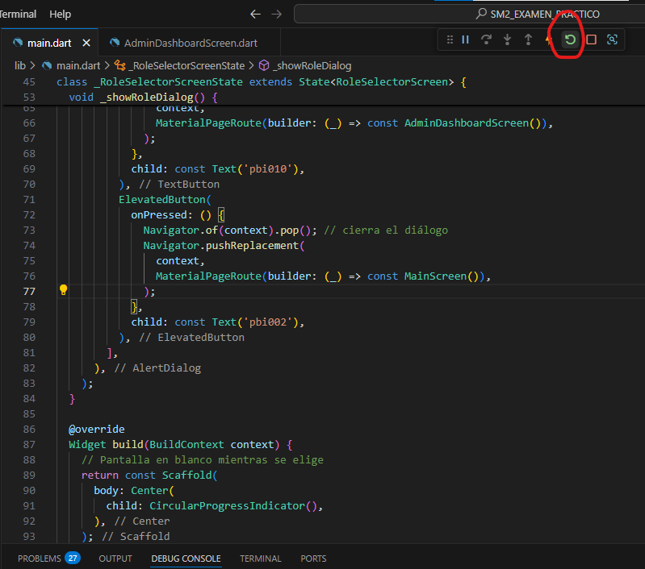
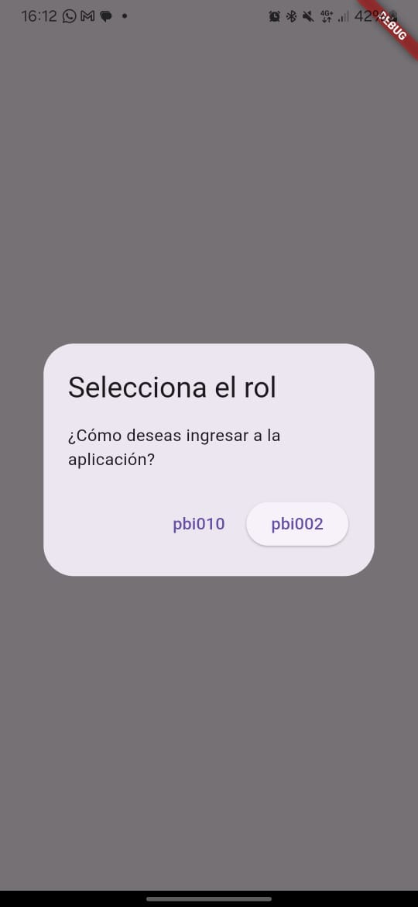
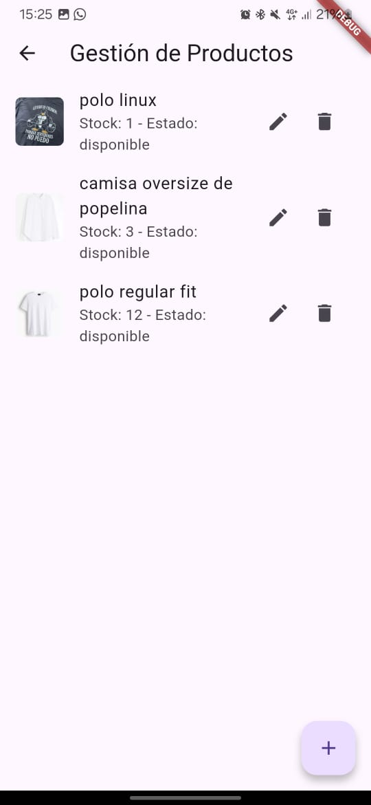
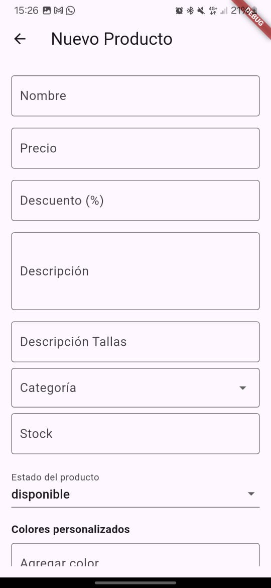
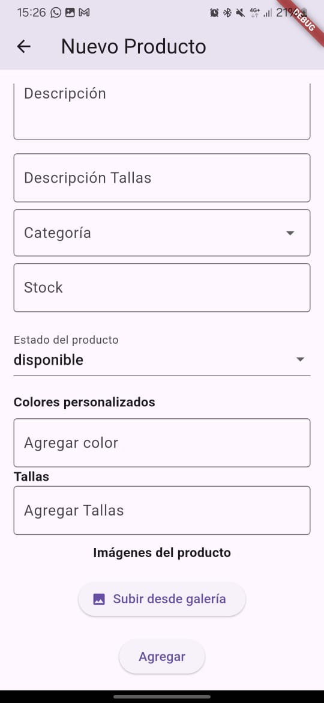
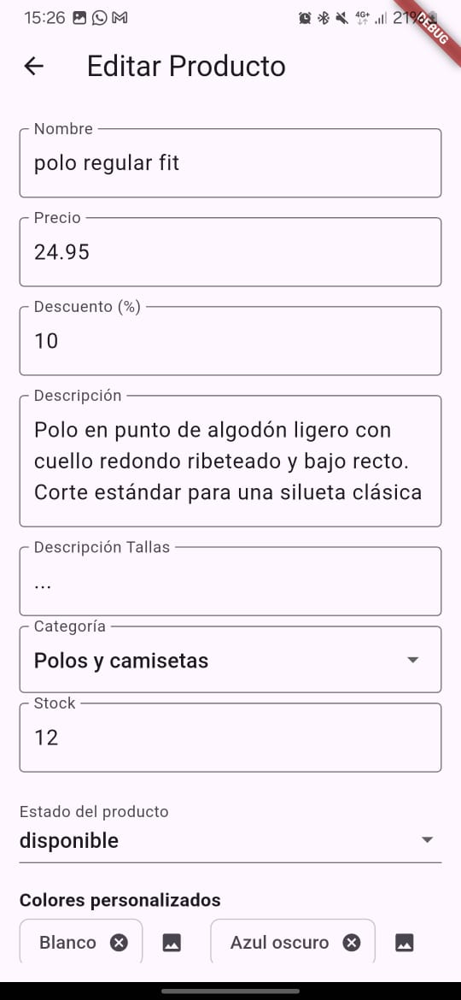
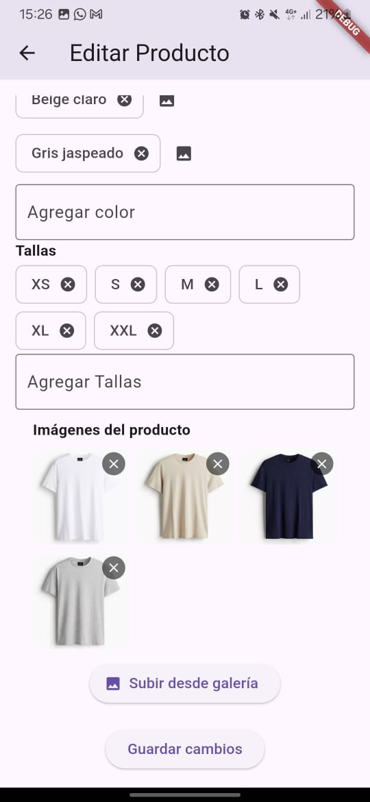
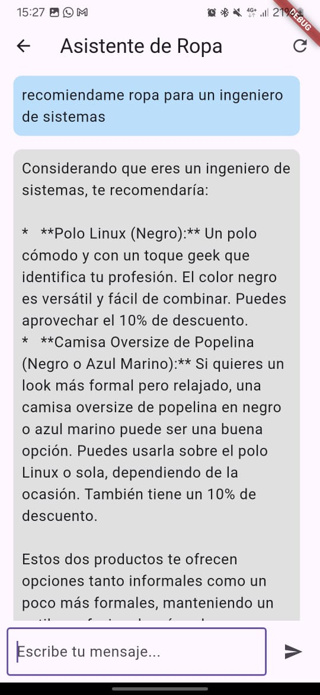

# SM2_EXAMEN_PRACTICO

# nombre : jesus antonio huallpa maron
# codigo : 2021071085

## Descripción del Proyecto

Este proyecto corresponde al examen práctico de la unidad II. El objetivo es implementar dos funcionalidades del **Product Backlog** que se describen a continuación:

### Funcionalidades Implementadas

1. **Gestionar productos por categorías** (pbi002): 
   - Permite gestionar productos, categorizándolos de acuerdo con su tipo, lo cual facilita su organización y acceso.
   - Los usuarios pueden agregar, editar y eliminar productos dentro de categorías específicas.

2. **Consultar recomendaciones a través del chatbot** (pbi010):
   - El chatbot sugiere productos a los usuarios en función de sus preferencias y el historial de navegación.
   - Implementa un sistema de interacción que permite al usuario obtener recomendaciones personalizadas.
## Implementacion
- una vez clonado el proyecto debe tener flutter instalado lo puede verificar en si powershell comando flutter doctor.
- la version de sdk: ^3.7.2 para poder ejecutar el proyecto si no tienen la version reciente ejecutar (flutter upgrade

).
- luego debe ejecutar "flutter pub get" y listo 
## Capturas de Pantalla

# en la primera captura se explica que para cambiar de pbi debe selecionar el icono de reiniciar 

# luego le aparecera esta opcion para camiar de pbi seleciona la que va a revisar

# funciones de pbi002 gestionar productos 

# funciones de pbi010 chat bot de recomendaciones

## Enlaces y Referencias

- **Librerías utilizadas**:

  - [cupertino_icons ^1.0.8](https://pub.dev/packages/cupertino_icons) – Iconos estilo iOS.
  - [image_picker ^1.1.2](https://pub.dev/packages/image_picker) – Selección de imágenes desde la galería o cámara.
  - [firebase_storage 11.6.5](https://pub.dev/packages/firebase_storage) – Almacenamiento en Firebase.
  - [http ^0.13.6](https://pub.dev/packages/http) – Realizar solicitudes HTTP.
  - [cloud_firestore ^4.8.3](https://pub.dev/packages/cloud_firestore) – Base de datos en tiempo real de Firebase.
  - [firebase_core ^2.31.0](https://pub.dev/packages/firebase_core) – Núcleo de Firebase necesario para inicializar los servicios.
  - [dialogflow_flutter ^1.0.0](https://pub.dev/packages/dialogflow_flutter) – Integración con Dialogflow para chatbots.
  - [protobuf ^2.1.0](https://pub.dev/packages/protobuf) – Soporte para mensajes Protocol Buffers.
  - [uuid 3.0.7](https://pub.dev/packages/uuid) – Generador de UUIDs.
  - [flutter_dotenv ^5.2.1](https://pub.dev/packages/flutter_dotenv) – Manejo de variables de entorno desde un archivo `.env`.

- **API de productos**:

  - [Gemini Flash 2.0 (Google AI)](https://ai.google.dev/models/gemini) – API de lenguaje natural usada para el chatbot del sistema.
  
## Enlace al repositorio

[SM2_EXAMEN_PRACTICO en GitHub](https://github.com/jesushuallpa/SM2_EXAMEN_PRACTICO)
